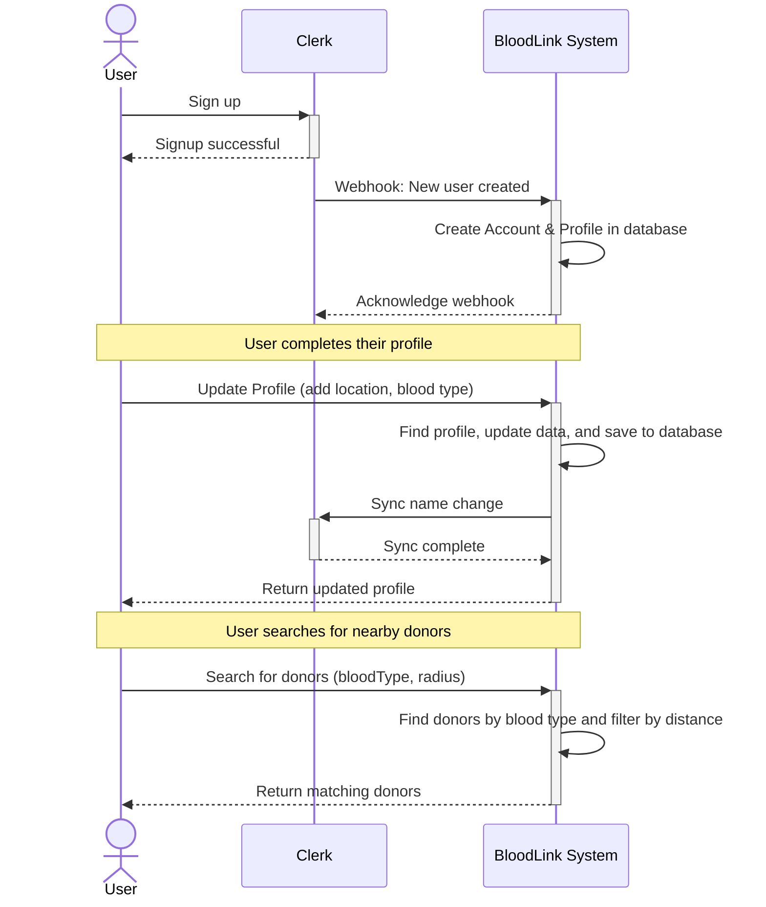

# Customer Registration, Profile, and Search Flow

This document outlines the class structure and interaction sequences for customer registration, profile management, and searching for other customers based on blood type and proximity.

---

## Class Diagram

This diagram shows the main entities involved in the customer-related flows and their relationships.

---

## Sequence Diagram

This diagram shows the complete customer journey, from registration and profile setup to searching for other donors, with internal components grouped for simplicity.

