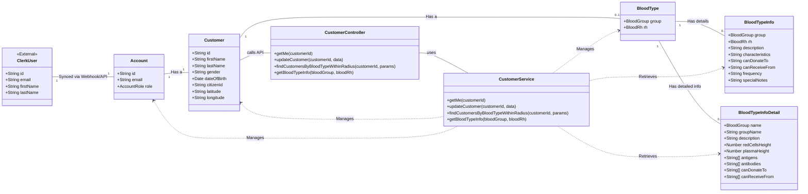
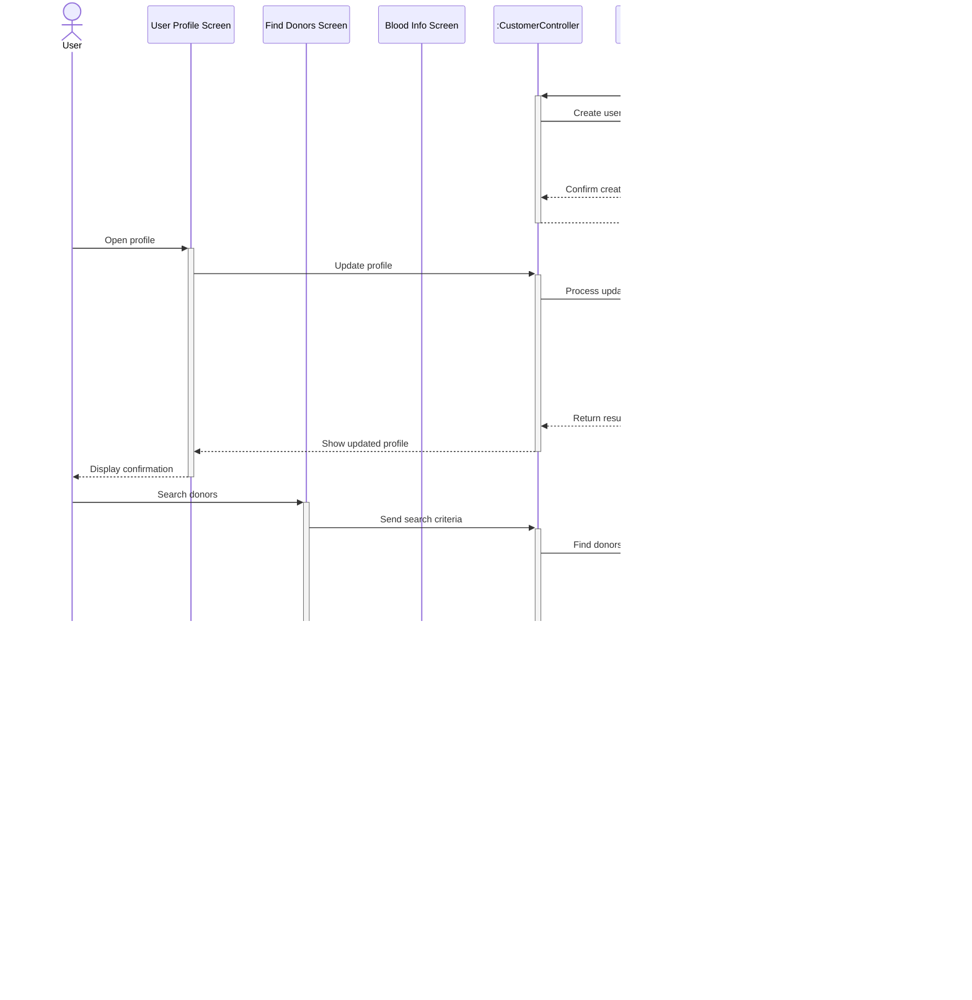

# Customer Registration, Profile, and Search Flow

---

## Class Diagram

```mermaid
classDiagram
    direction LR

    class ClerkUser {
        <<External>>
        +String id
        +String email
        +String firstName
        +String lastName
    }

    class CustomerController {
        +getMe(customerId)
        +updateCustomer(customerId, data)
        +findCustomersByBloodTypeWithinRadius(customerId, params)
        +getBloodTypeInfo(bloodGroup, bloodRh)
    }

    class CustomerService {
        +getMe(customerId)
        +updateCustomer(customerId, data)
        +findCustomersByBloodTypeWithinRadius(customerId, params)
        +getBloodTypeInfo(bloodGroup, bloodRh)
    }

    class Customer {
        +String id
        +String firstName
        +String lastName
        +String gender
        +Date dateOfBirth
        +String citizenId
        +String latitude
        +String longitude
    }

    class Account {
        +String id
        +String email
        +AccountRole role
    }

    class BloodType {
        +BloodGroup group
        +BloodRh rh
    }

    class BloodTypeInfo {
        +BloodGroup group
        +BloodRh rh
        +String description
        +String characteristics
        +String canDonateTo
        +String canReceiveFrom
        +String frequency
        +String specialNotes
    }

    class BloodTypeInfoDetail {
        +BloodGroup name
        +String groupName
        +String description
        +Number redCellsHeight
        +Number plasmaHeight
        +String[] antigens
        +String[] antibodies
        +String[] canDonateTo
        +String[] canReceiveFrom
    }

    ClerkUser "1" -- "1" Account : Synced via Webhook/API
    Account "1" -- "1" Customer : Has a
    Customer "1" -- "0..1" BloodType : Has a
    BloodType "1" -- "0..1" BloodTypeInfo : Has details
    BloodType "1" -- "0..1" BloodTypeInfoDetail : Has detailed info
    CustomerController -- CustomerService : uses
    Customer -- CustomerController : calls API
    CustomerService ..> Customer : Manages
    CustomerService ..> Account : Manages
    CustomerService ..> BloodType : Manages
    CustomerService ..> BloodTypeInfo : Retrieves
    CustomerService ..> BloodTypeInfoDetail : Retrieves

```

---

## Sequence Diagram

```mermaid
sequenceDiagram
    actor User
    participant User Profile Screen
    participant Find Donors Screen
    participant Blood Info Screen
    participant CustomerController as :CustomerController
    participant CustomerService as :CustomerService
    participant Database
    participant Clerk

    %% --- 1. Registration (Webhook) ---
    Note over Clerk, CustomerService: Registration via Clerk webhook
    Clerk->>+CustomerController: Send webhook
    CustomerController->>+CustomerService: Create user
    CustomerService->>+Database: Save user data
    Database-->>-CustomerService: Return saved data
    CustomerService-->>-CustomerController: Confirm creation
    CustomerController-->>-Clerk: Send acknowledgement

    %% --- 2. Profile Update ---
    User->>+User Profile Screen: Open profile
    User Profile Screen->>+CustomerController: Update profile
    CustomerController->>+CustomerService: Process update
    CustomerService->>+Database: Find customer
    Database-->>-CustomerService: Return customer
    CustomerService->>Database: Update profile
    Database-->>CustomerService: Confirm update
    CustomerService-->>-CustomerController: Return result
    CustomerController-->>-User Profile Screen: Show updated profile
    User Profile Screen-->>-User: Display confirmation

    %% --- 3. Find Nearby Donors ---
    User->>+Find Donors Screen: Search donors
    Find Donors Screen->>+CustomerController: Send search criteria
    CustomerController->>+CustomerService: Find donors
    CustomerService->>+Database: Get location
    Database-->>-CustomerService: Return location
    CustomerService->>Database: Query donors
    Database-->>CustomerService: Return matches
    CustomerService-->>-CustomerController: Return filtered results
    CustomerController-->>-Find Donors Screen: Show results
    Find Donors Screen-->>-User: Display donors

    %% --- 4. View Blood Type Information ---
    User->>+Blood Info Screen: View blood info
    Blood Info Screen->>+CustomerController: Request info
    CustomerController->>+CustomerService: Get blood data
    CustomerService->>+Database: Query blood info
    Database-->>-CustomerService: Return info
    CustomerService-->>-CustomerController: Return data
    CustomerController-->>-Blood Info Screen: Show information
    Blood Info Screen-->>-User: Display blood type details

```

---
