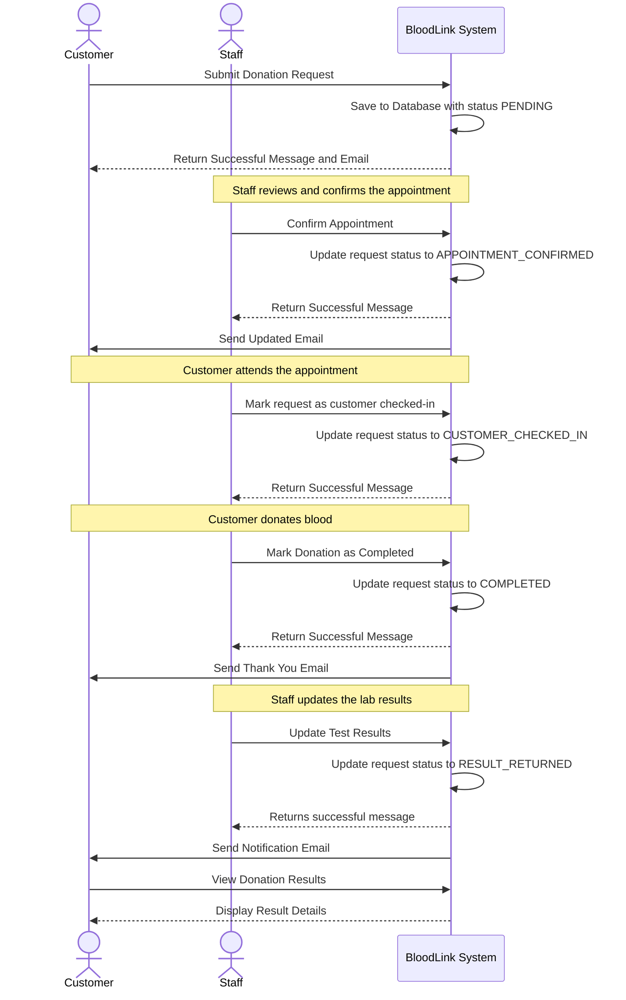
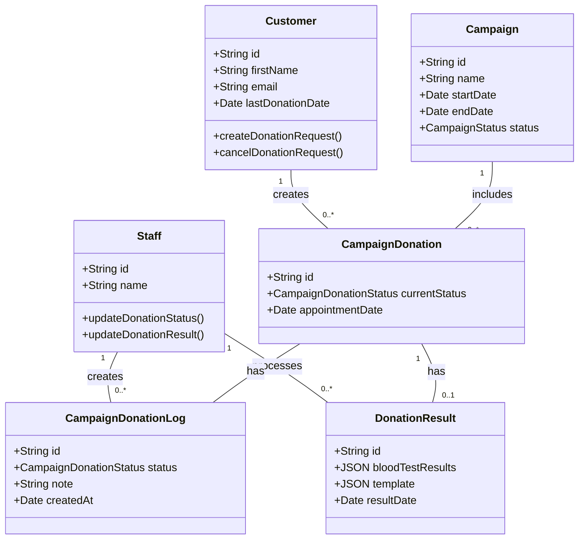
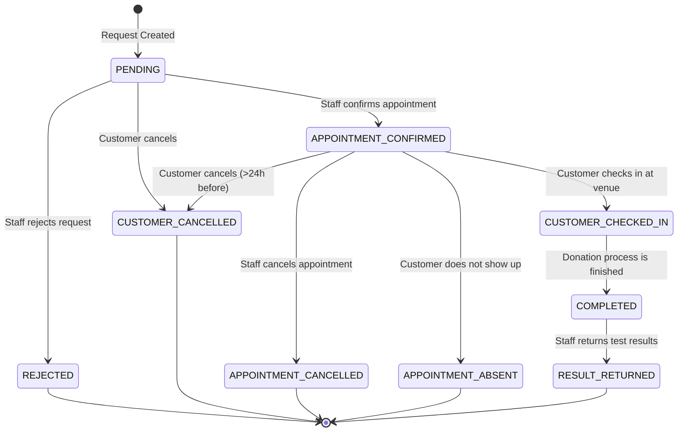

# Donation Request and Result Flow Documentation

This document outlines the business logic, validation rules, and overall flow for creating a donation request, managing its status, and returning the final donation results.

## 1. Create Donation Request

This is the initial step where a customer creates a request to donate blood for a specific campaign.

**Endpoint:** `POST /donations/requests`

### Business Logic & Validation Rules:

1.  **Campaign Validation:**

    - The specified `campaignId` must correspond to an existing campaign.
    - The campaign must be **active** (`status === CampaignStatus.ACTIVE`).
    - The request must be made within the campaign's start and end dates.

2.  **Donor Validation:**

    - The `customerId` (from the authenticated user) must correspond to an existing customer.
    - The donor cannot have another **active** donation request. An active request is one with a status of `PENDING`, `APPOINTMENT_CONFIRMED`, `CUSTOMER_CHECKED_IN`, or `COMPLETED`.
    - The donor cannot create more than one donation request for the **same campaign**.

3.  **Appointment Date Validation:**

    - The `appointmentDate` is optional.
    - If the associated campaign has a specific `bloodCollectionDate`, the provided `appointmentDate` must fall on the **exact same day** (year, month, and day are compared).

4.  **Process Flow:**
    - A new `CampaignDonation` entity is created with the initial status `PENDING`.
    - A `CampaignDonationLog` entry is created to record the creation event.
    - An email notification is sent to the donor confirming that their request has been received.

---

## 2. Update Donation Request Status (Staff)

Staff members manage the lifecycle of a donation request by updating its status.

**Endpoint:** `PATCH /donations/requests/:id/status`

### Status Transition Validation:

The system enforces a strict state machine for status transitions. A request's status can only change from its current state to a valid next state.

| Current Status          | Allowed Next Statuses                                                                                   |
| ----------------------- | ------------------------------------------------------------------------------------------------------- |
| `PENDING`               | `REJECTED`, `APPOINTMENT_CONFIRMED`, `CUSTOMER_CANCELLED`                                               |
| `APPOINTMENT_CONFIRMED` | `APPOINTMENT_CANCELLED`, `APPOINTMENT_ABSENT`, `COMPLETED`, `CUSTOMER_CANCELLED`, `CUSTOMER_CHECKED_IN` |
| `CUSTOMER_CHECKED_IN`   | `COMPLETED`                                                                                             |
| `COMPLETED`             | `RESULT_RETURNED`                                                                                       |
| `APPOINTMENT_CANCELLED` | (None)                                                                                                  |
| `APPOINTMENT_ABSENT`    | (None)                                                                                                  |
| `RESULT_RETURNED`       | (None)                                                                                                  |
| `REJECTED`              | (None)                                                                                                  |
| `CUSTOMER_CANCELLED`    | (None)                                                                                                  |

### Business Logic:

1.  **Status Update:** The `currentStatus` of the `CampaignDonation` is updated.
2.  **Logging:** A `CampaignDonationLog` entry is created to record the status change, the staff member who made the change, and any associated notes.
3.  **Email Notification:** An email is sent to the donor informing them of the status update. The email content is tailored to the new status.
4.  **Last Donation Date Update:** When the status changes to `COMPLETED` or `RESULT_RETURNED`, the `lastDonationDate` on the `Customer` entity is updated to the current date.
5.  **Eligibility Reminder:** After the `lastDonationDate` is updated, a reminder is scheduled to notify the donor when they are eligible to donate again (typically 3 months later).

---

## 3. Cancel Donation Request (Customer)

Customers can cancel their own donation requests under specific conditions.

**Endpoint:** `PATCH /donations/my-requests/:id/cancel`

### Business Logic & Validation Rules:

1.  **Allowed Statuses:** A request can only be cancelled by the customer if its status is `PENDING` or `APPOINTMENT_CONFIRMED`.
2.  **24-Hour Rule for Confirmed Appointments:** If the request has a status of `APPOINTMENT_CONFIRMED`, it can only be cancelled if the cancellation is made at least **24 hours before** the scheduled `appointmentDate`.
3.  **Process Flow:**
    - The status is updated to `CUSTOMER_CANCELLED`.
    - A log entry is created.
    - An email notification is sent to the donor.

---

## 4. Update Donation Result (Staff)

After the donation is completed and lab results are available, a staff member updates the donation result.

**Endpoint:** `PATCH /donations/requests/:id/result`

### Business Logic & Validation Rules:

1.  **Prerequisite Status:** The donation request must be in the `COMPLETED` status before results can be updated.
2.  **Donation Result Creation:**
    - If a `DonationResult` record does not already exist for the donation, one is created automatically when the request status becomes `COMPLETED`.
    - This endpoint updates the existing `DonationResult`.
3.  **Template Handling:**
    - The staff provides a `templateId`.
    - The system fetches the corresponding `DonationResultTemplate` and stores a **JSON snapshot** of it within the `DonationResult`. This ensures the result's structure is preserved even if the master template is changed later.
4.  **Process Flow:**
    - The `DonationResult` is updated with blood test results and the template snapshot.
    - The `CampaignDonation` status is automatically updated to `RESULT_RETURNED`.
    - A log entry is created for the status change.
    - An email is sent to the donor notifying them that their results are available.

---

## Sequence Diagram

---

## Class Diagram

This diagram shows the main entities involved in the donation flow and their relationships.

---

## State Machine Diagram

This diagram illustrates the lifecycle of a `CampaignDonation` request, showing all possible statuses and the transitions between them.

