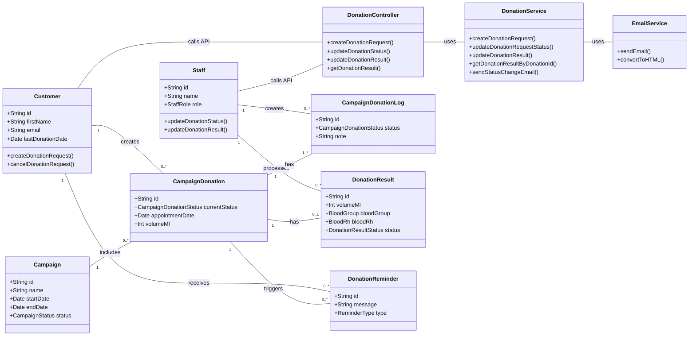

## Sequence Diagram

This diagram shows the detailed, end-to-end flow for a donation request, from creation to result retrieval.

---

## Class Diagram

This diagram shows the main backend entities and services involved in the donation flow and their relationships.

---

## State Machine Diagram

This diagram illustrates the lifecycle of a `CampaignDonation` request, showing all possible statuses and the transitions between them.

