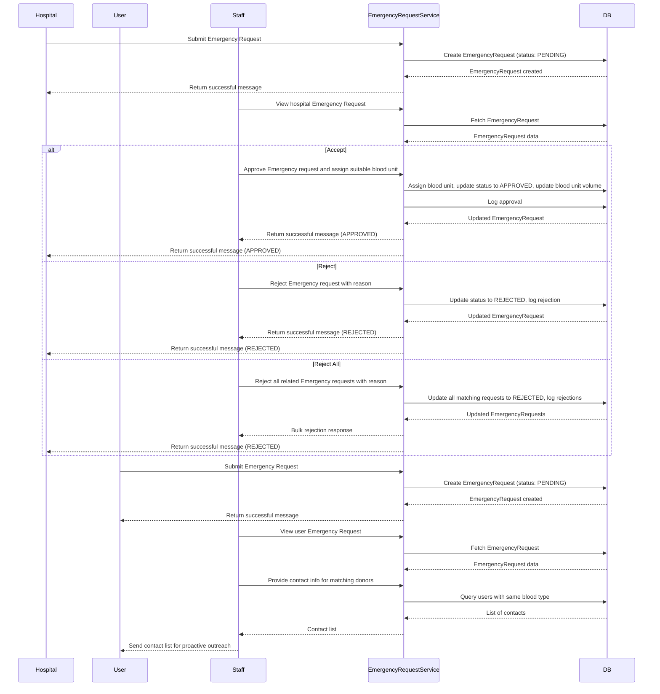

# Emergency Request Flow

This document describes the business flow for Emergency Requests, involving three roles: **Staff**, **User**, and **Hospital**.

---

## Business Flow Overview

### **Case 1: Hospital-Initiated Emergency Request**

- **Hospital** submits an emergency request (blood type, volume, etc.).
- **Staff** reviews the request and can:
  - **Accept**: Assign a blood unit, set used volume, and approve the request.
  - **Reject**: Provide a rejection reason.
  - **Reject All**: (If implemented) Reject all similar requests for the same blood type.
- All actions are logged for audit.

### **Case 2: User-Initiated Emergency Request**

- **User** submits an emergency request (blood type, volume, etc.).
- **Staff** reviews the request and, instead of assigning a blood unit, provides the contact information of people with the same blood type so the requester can proactively contact them.
- **User** receives the contact list and can follow up directly.

---

## Mermaid Sequence Diagram

---

**How to use:**

- Copy the above Mermaid script.
- Paste it into your documentation markdown file or any Mermaid live editor.
- Render to visualize the business flow for both Hospital and User emergency requests.
