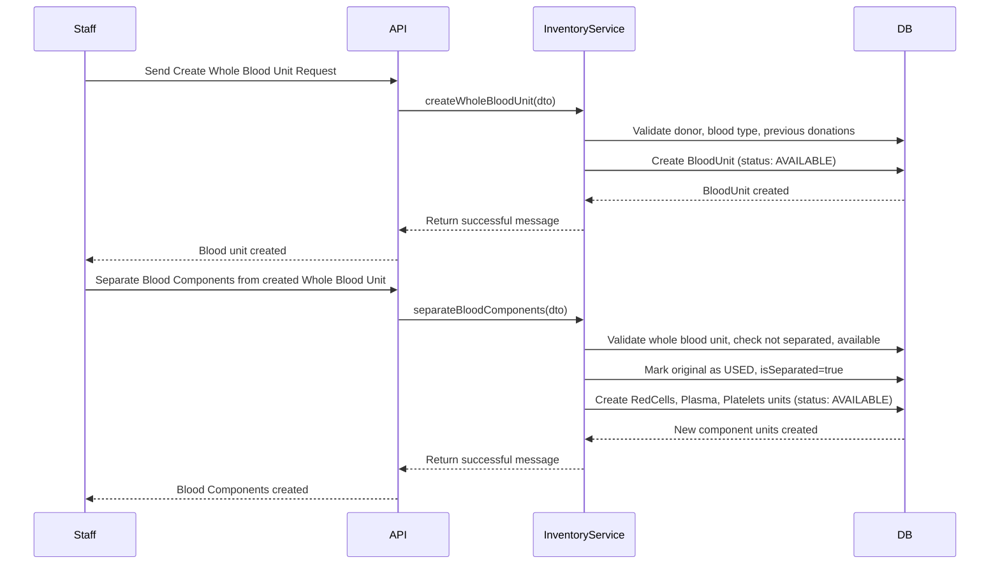
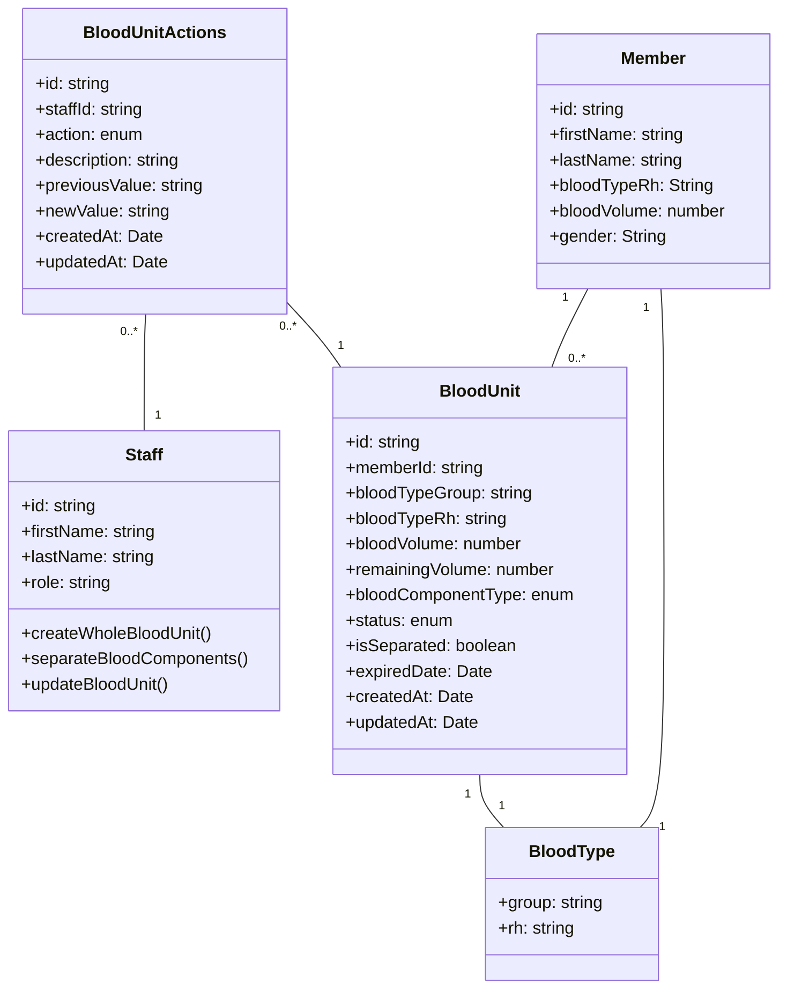

# Blood Unit Creation & Management Flow (Post-Campaign/Donor Result)

This document describes the business flow for creating and managing blood units after a Blood Donation Campaign is finished or after receiving a blood donor's result. The process is typically performed by Staff members.

---

## Business Flow Overview

### 1. **Trigger Event**

- **Staff** initiates the process after a campaign ends or after a donor's result is received.

### 2. **Create Whole Blood Unit**

- Staff uses the API endpoint to create a new whole blood unit.
- System validates:
  - Donor (customer) exists.
  - Blood type exists and matches previous donations (if any).
  - Blood volume and remaining volume are logical.
  - Expiration date is in the future.
- System creates a new `BloodUnit` entity with status `AVAILABLE`.

### 3. **(Optional) Separate Blood Components**

- Staff may request to separate a whole blood unit into components (Red Cells, Plasma, Platelets).
- System validates:
  - The unit is a whole blood unit, not already separated, and is available.
  - Total separated volume does not exceed original.
  - Expiration date is valid.
- System:
  - Marks the original unit as `USED` and `isSeparated = true`.
  - Creates three new `BloodUnit` entities for each component, all `AVAILABLE`.

### 4. **Update Blood Unit**

- Staff can update blood unit details (volume, status, etc.).
- System validates changes and logs all updates as `BloodUnitAction` for audit.

### 5. **Audit Trail**

- Every significant change (status, volume, etc.) is logged with staff info for traceability.

### 6. **Query & Manage Inventory**

- Staff can query, filter, and manage all blood units (by status, type, expiration, etc.).

---

## Mermaid Sequence Diagram

Below is a Mermaid script to visualize the above business flow. Copy and paste it into any Mermaid-compatible renderer (e.g., mermaid.live, VSCode extension, or your docs).

---

## Mermaid Class Diagram

Below is a Mermaid class diagram script that visualizes the main entities and their relationships in the blood unit management flow.

---

### Explanation of Key Relationships

- **Customer** donates one or more **BloodUnit**s.
- Each **BloodUnit** has a **BloodType**.
- A **BloodUnit** may have a `parentWholeBlood` (for separated components).
- **BloodUnitActions** log changes to a **BloodUnit** and are performed by a **Staff** member.

---

**How to use:**

- Copy the above Mermaid script.
- Paste it into your documentation markdown file or any Mermaid live editor.
- Render to visualize the class structure and relationships.
